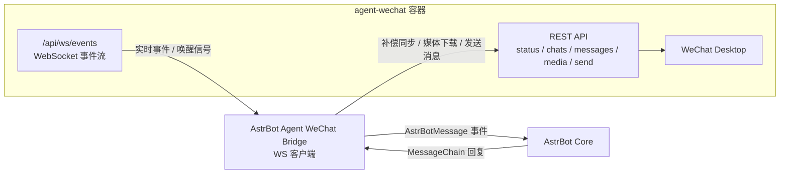

# AstrBot Agent WeChat Bridge

这是一个用于将 [AstrBot](https://github.com/AstrBotDevs/AstrBot) 接入个人微信的插件，底层依赖 [`agent-wechat`](https://github.com/thisnick/agent-wechat) 提供的 WebSocket 和 REST API。

本项目现在采用“`/api/ws/events` 事件流优先 + REST 补偿同步”的接入方式，参考了上游 `agent-wechat` 仓库中的 WebSocket 与消息同步实现思路：

- `WS /api/ws/events`：建立事件 WebSocket 连接
- `GET /api/status/auth`：检查微信登录状态
- `GET /api/chats`：做补偿同步，获取未读会话
- `POST /api/chats/{id}/open`：打开会话并清除未读
- `GET /api/messages/{id}`：拉取新消息
- `GET /api/messages/{id}/media/{localId}`：下载媒体附件
- `POST /api/messages/send`：发送回复

## 架构图



说明：

- WebSocket 连接负责“优先触发”同步
- REST 负责鉴权检查、消息补偿、媒体下载和消息发送
- 这样即使上游事件流暂时没有完整广播所有消息，也不会影响插件可用性

## 功能说明

- 注册 AstrBot 平台适配器 `agent_wechat`
- 通过 WebSocket 客户端连接 `agent-wechat`
- 在 WS 事件或空闲超时后执行 REST 补偿同步
- 将微信私聊和群聊消息转换为 AstrBot 事件
- 将 AstrBot 的回复通过 `agent-wechat` 发回微信
- 支持文本、图片、文件、语音类消息发送
- 支持私聊白名单、群聊白名单、群聊 `@` 触发

## 运行前提

1. 已部署并可访问的 `agent-wechat` 服务
2. 对应微信账号已通过 `agent-wechat` 登录
3. AstrBot 版本 `>= 4.16`

本地快速启动：

```bash
npm install -g @agent-wechat/cli
wx up
```

Docker Compose 示例：

```yaml
services:
  agent-wechat:
    image: ghcr.io/thisnick/agent-wechat:latest
    container_name: agent-wechat
    security_opt:
      - seccomp=unconfined
    cap_add:
      - SYS_PTRACE
    ports:
      - "6174:6174"
    volumes:
      - agent-wechat-data:/data
      - agent-wechat-home:/home/wechat
    restart: unless-stopped

volumes:
  agent-wechat-data:
  agent-wechat-home:
```

## 安装方式

将本仓库放入 AstrBot 的插件目录，然后重启 AstrBot。

## 平台配置

AstrBot 加载插件后，在平台管理中添加 `agent_wechat`，配置项如下：

| 配置项 | 默认值 | 说明 |
| --- | --- | --- |
| `server_url` | `http://localhost:6174` | `agent-wechat` REST API 地址 |
| `token` | 空 | 如果服务开启鉴权，填写 Bearer Token |
| `poll_interval_ms` | `1000` | WS 空闲时的 REST 补偿同步间隔 |
| `auth_poll_interval_ms` | `30000` | 登录状态检查间隔 |
| `dm_policy` | `open` | 私聊策略：`open` / `allowlist` / `disabled` |
| `allow_from` | `[]` | 私聊白名单，`dm_policy=allowlist` 时生效 |
| `group_policy` | `open` | 群聊策略：`open` / `allowlist` / `disabled` |
| `group_allow_from` | `[]` | 群聊发送者白名单，`group_policy=allowlist` 时生效 |
| `require_mention` | `true` | 群聊中是否必须 `@机器人` 才转发给 AstrBot |

## 使用说明

1. 确保 `agent-wechat` 已正常启动
2. 确保微信账号已登录
3. 在 AstrBot 中启用本插件和 `agent_wechat` 平台
4. 完成配置后，插件会自动建立 WS 连接，并在需要时做 REST 补偿同步

## 实现细节

- 忽略以 `gh_` 开头的公众号/服务号会话
- 首次同步某个会话时，只处理未读尾部消息，不回灌整段历史
- 媒体下载采用与上游一致的方式：先 `open chat`，再按 `localId` 取媒体
- 针对媒体准备延迟，下载逻辑带有重试机制
- 当消息数据库写入晚于未读状态变化时，会用 `lastMsgLocalId` 做补偿轮询
- 当前上游的 `/api/ws/events` 路由已经存在，但实时消息广播仍未完全接通，所以插件保留 REST 补偿同步以保证稳定性
- 由于 `agent-wechat` 没有原生的微信 `@` 发送接口，AstrBot 的 `At` 组件会降级为普通文本

## 更新日志

从当前版本开始，每次版本更新都会同步记录到 [CHANGELOG.md](./CHANGELOG.md)。

## 本地校验

```bash
python3 -m compileall src tests
pytest
```

如果当前环境没有安装 `pytest`，请先执行：

```bash
pip install -r requirements.txt
```
